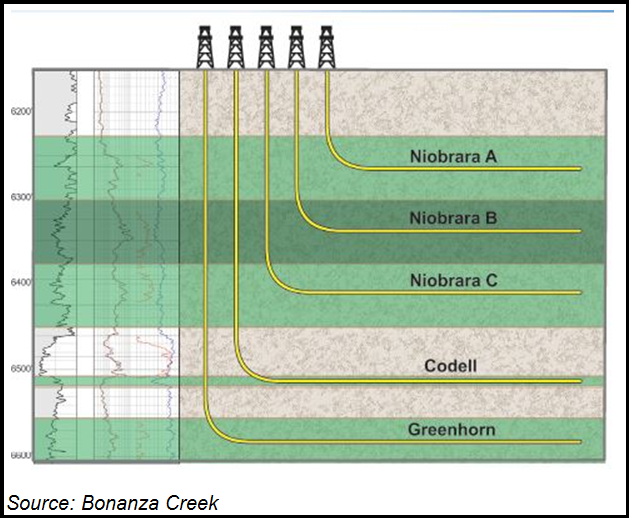
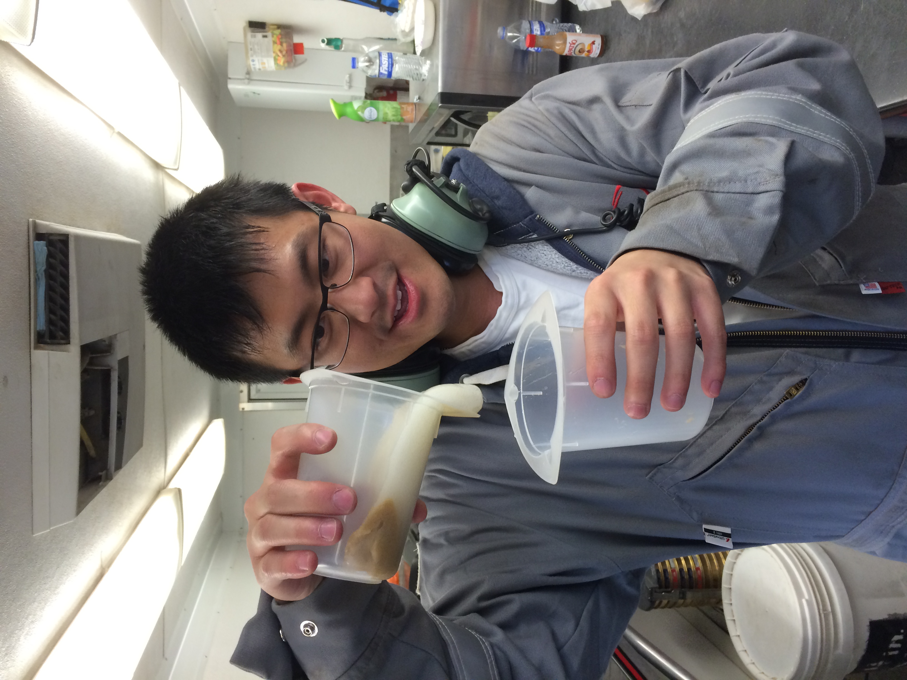
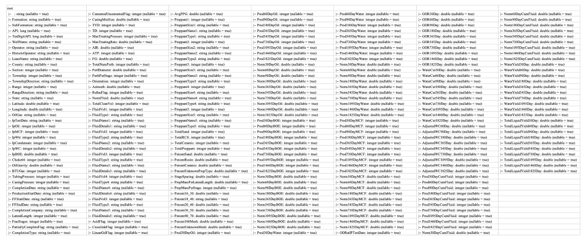
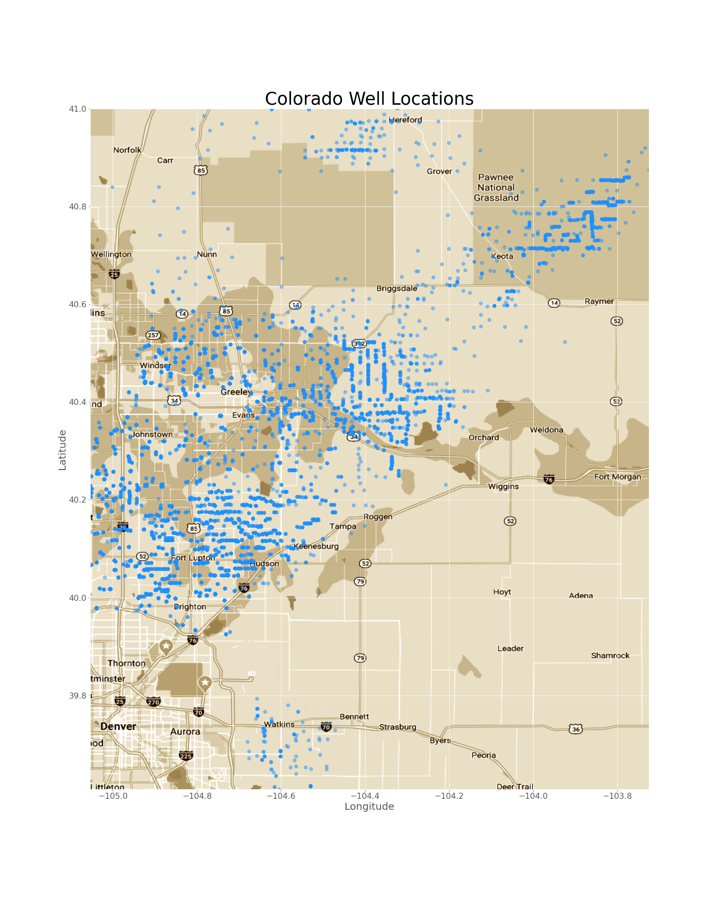
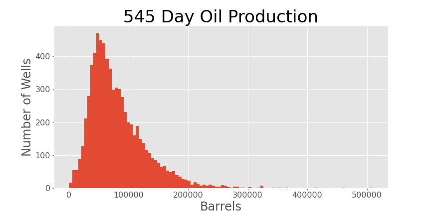
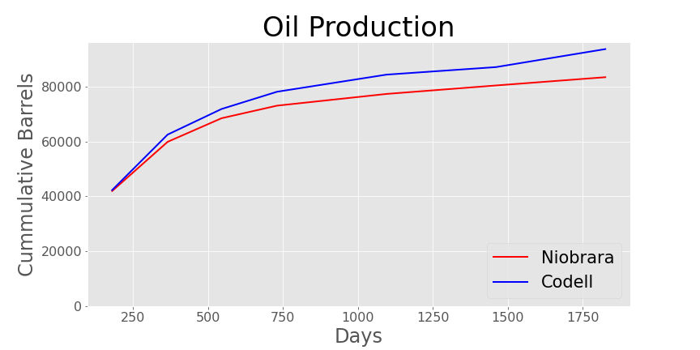
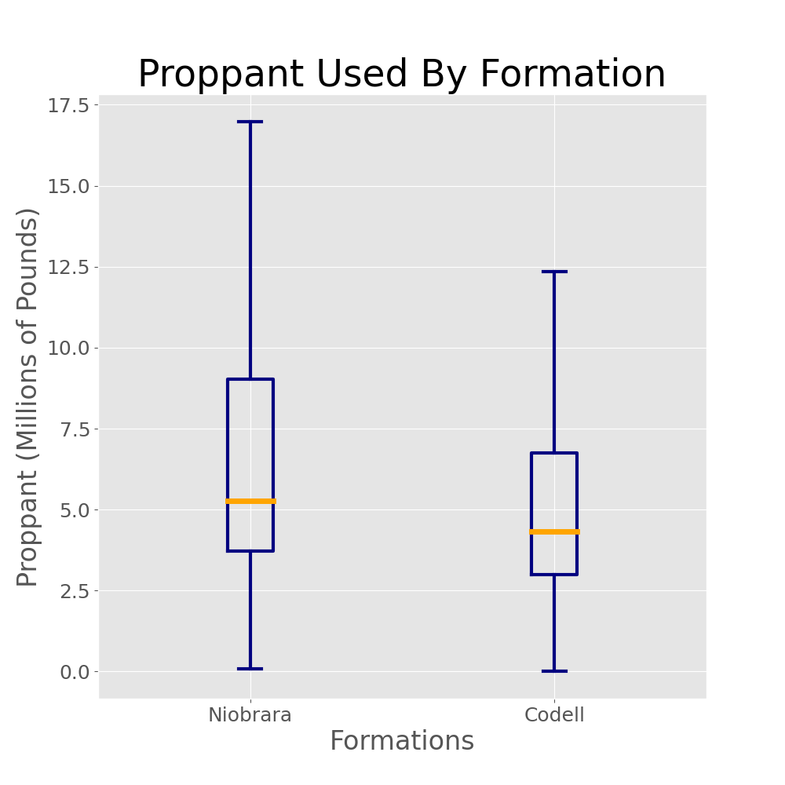

# Oil Production of Fluid Systems

**\_\_\_\_\_\_\_\_\_\_\_\_\_\_\_\_\_\_\_\_\_\_\_\_\_\_\_\_\_\_\_\_\_\_\_\_\_\_\_\_\_\_\_\_\_\_\_\_\_\_\_\_\_\_\_\_\_\_\_\_\_\_\_\_\_\_\_\_\_\_\_\_\_\_\_\_\_\_**

##

## Background and Motivation

Every operator in the Oil and Gas industry spends millions of dollars and time to create the best performing wells. From my experience working in the industry I believe one of the most important factors for better production depends of the type of fluid system used during the hydraulic fracturing (frac) process on a horizontal well. Proppant (sand) also influences production results; however, it is the fluid design that would carry the proppant to the formation and influence fracture geometry.

They're three commonly used fluid systems, Slickwater, Gel, and Hybrid. Slickwater would be water mixed with a friction reducing chemical – still watery; Gel will be a thick fluid with a high viscosity (internal friction) and Hybrid is a mix of Slickwater and Gel. The type of fractures these fluid system cause is like having many roads for traffic (Slickwater), or a few highways only with no roads(Gel).

## The Data

Reached out to former colleagues for well information in the Denver-Julesburg Basin (DJ Basin). Received a redacted Excel file where internal data has been removed. Converted the Excel file to a CSV format for Exploratory Data Analysis (EDA). The data had 219 columns and 9974 rows of oil wells. Spark was used to clean the data and run SQL queries to help along with the data cleaning process.

Processed the data to only have wells in Colorado and removed any wells in Wyoming. Mapped out the latitudes and longitudes of the data over a map.

Some simple histogram plot for EDA.

Able to compare production results from Niobrara and Codell formation.

## Hypothesis Testing

Ho: 
* Fluid A Production = Fluid B Production

HA: 
* Fluid A Production > Fluid B Production 
* Fluid A Production < Fluid B Production
  

Due to the high cost and for return on investment the standard significance level of 0.05 would be to great so a 0.01 was used. A comparison of the three fluid designs was conducted using the Mann-Whittney U Test. First, was to compare the wins for each fluid system then using scipy to calculate the p-value. Due to the multiple comparisons, the Bonferroni Correction was applied for a new alpha of 0.003.
 
 

### Data Set

| Slickwater and Gel |           |  | Slickwater and Hybrid |          |  | Gel and Hybrid |           |
|--------------------|-----------|--|-----------------------|----------|--|----------------|-----------|
| Slickwater Wins    | 8154753.5 |  | Slickwater Wins       | 2176643  |  | Gel Wins       | 1124037.5 |
| Gel Wins           | 4977533.5 |  | Hybrid Wins           | 2833288  |  | Hybrid Wins    | 2445815.5 |
| p-value            | 3.54E-70  |  | p-value               | 6.15E-12 |  | p-value        | 1.60E-77  |

So this processed was used to make sure that each formation would produce the same results.

### Niobrara
| Slickwater and Gel |          |  | Slickwater and Hybrid |          |  | Gel and Hybrid |          |
|--------------------|----------|--|-----------------------|----------|--|----------------|----------|
| Slickwater Wins    | 5034804  |  | Slickwater Wins       | 1335229  |  | Gel Wins       | 768681   |
| Gel Wins           | 3009388  |  | Hybrid Wins           | 169859   |  | Hybrid Wins    | 1650663  |
| p-value            | 3.54E-60 |  | p-value               | 3.55E-08 |  | p-value        | 4.79E-62 |

### Codell
| Slickwater and Gel |          |  | Slickwater and Hybrid |          |  | Gel and Hybrid |          |
|--------------------|----------|--|-----------------------|----------|--|----------------|----------|
| Slickwater Wins    | 347242   |  | Slickwater Wins       | 95360.5  |  | Gel Wins       | 32745.5  |
| Gel Wins           | 228696   |  | Hybrid Wins           | 139693.5 |  | Hybrid Wins    | 76341.5  |
| p-value            | 2.12E-11 |  | p-value               | 1.37E-05 |  | p-value        | 2.51E-17 |

 
 

## Conclusion

Overall the Gel fluid system performs the weakest compared to Slickwater and Hybrid fluid system. On the other hand, Hybrid outperforms Slickwater in some cases but due to the higher cost of utilizing a Hybrid fluid system it may not be a cost an operator would endeavor. 